# Employee Churn Rate Problem


A company concerned about the growth in the attrition rate of its employees has asked us to carry out a predictive analysis to be able to anticipate possible future abandonments. So that at the end of the project, you know which group of employees your talent retention efforts focused on.

To carry out this project, I used two tools that Azure ML provide us to train Machine Learning models: Azure Hyperdrive and Azure AutoML. Then, I deployed the best model generated by both methods and consumed the model endpoint to provide some predictions.

The steps followed in the project are summarized in the following diagram:

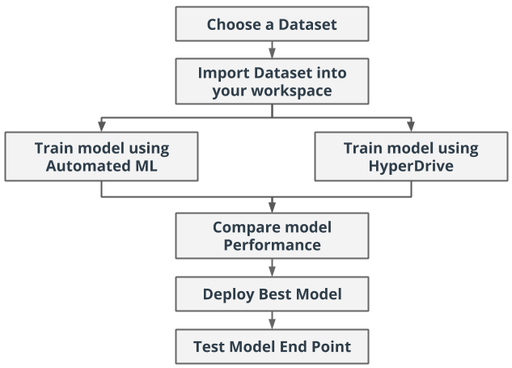

## Project Set Up and Installation

All the useful files can be found in `\starter_file` section.

## Files

Useful files:
  
  * `automl.ipynb`
  * `hyperparameter_tuning.ipynb`
    * `train.py`
    * `conda_dependencies.yml`

The file `automl-copy.ipynb` is left just to show the RunDetails section of the AutoML process.

## Dataset

### Overview

For this project the company have given us the file `HR Dataset`, which can download be downloaded from the following link: https://raw.githubusercontent.com/aiplanethub/Datasets/master/HR_comma_sep.csv. The file contains the following variables:

  * **satisfaccion_nivel :** It is the level of employee satisfaction, which takes values between 0-1.
  * **last_ Evaluation :** Employee's preformance evaluation. Values between 0-1.
  * **number_projects :** How many projects are asigned to thar employee?
  * **average_monthly_hours :** How many average hours does an employee work in a month?
  * **time_spent_company :** Employee experience. Number of years an employee has been in the company.
  * **work_accident :** Whether an employee has had a work accident or not.
  * **Promotion_last_5years :** Whether an employee has had a promotion in the last 5 years or not.
  * **sales :** Department/division to which the employee belongs.
  * **salary :** Salary level of the employee (low, medium or high).
  * **left :** Whether the employee has left the company or not (0: No, 1: Yes).


The variable to predict (target) is `left` and the rest can be used as explanatory variables for the study. A sample of the data is as follows:


### Task

The aim of this project is to develop a machine learning model that can predict whether an employee is going to leave the company or not. Therefore, the target variable is the variable `left`. Since it can take just to possible values, we have to perform a classification task. 

A sample of the data is as follows:

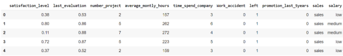

### Access

The way I uploaded the dataset to the AzureML environment, was using the following piece of code that you can find in the Jupyter Notebooks `automl.ipynb` and `hyperparameter_tuning.ipynb`.

```ruby
ws = Workspace.from_config()

# choose a name for experiment
experiment_name = 'automl_experiment'
project_folder = './pipeline-project'

experiment=Experiment(ws, experiment_name)


#Source of the data: https://raw.githubusercontent.com/aiplanethub/Datasets/master/HR_comma_sep.csv
# We first check if the data is already loaded inthe Workspace. Otherwise, create it from the file

found = False
key = "HR Dataset"
description_text = "HR Dataset for capstone project"

if key in ws.datasets.keys(): 
        found = True
        dataset = ws.datasets[key] 

if not found:
        # Create AML Dataset and register it into Workspace
        example_data = 'https://raw.githubusercontent.com/aiplanethub/Datasets/master/HR_comma_sep.csv'
        dataset = Dataset.Tabular.from_delimited_files(example_data)        
        #Register Dataset in Workspace
        dataset = dataset.register(workspace=ws,
                                   name=key,
                                   description=description_text)


df = dataset.to_pandas_dataframe()
```

In this code we defined a variable that includes the workspace definition. Then we check whether the dataset is already uploaded to the AzureML platform, and if that is not the case we upload it.

Once the dataset is uploaded into AzureML, you can find it in the `Data` section of the platform:

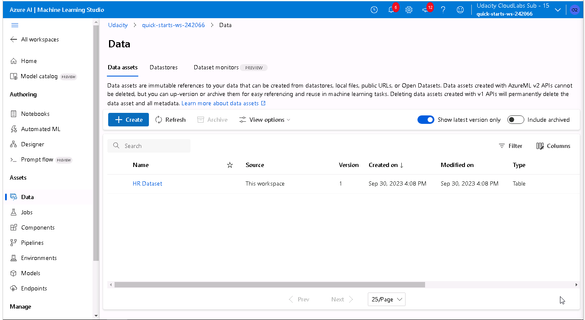

We can get a sample of the dataset using the `Explore` window.

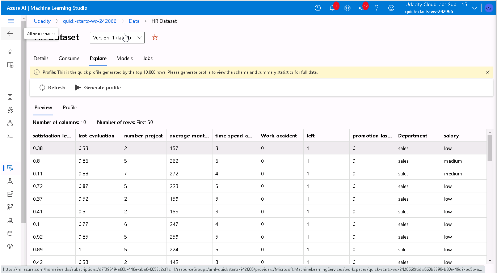

## Automated ML

In the following piece of code, I include the AutoML configuration that I have chosen for this experiment.

```ruby
automl_settings = {
    "experiment_timeout_minutes": 20,
    "max_concurrent_iterations": 5,
    "primary_metric" : 'AUC_weighted'
}

# TODO: Put your automl config here
automl_config = AutoMLConfig(compute_target=cpu_cluster,
                             task = "classification",
                             training_data=dataset,
                             label_column_name="left",   
                             path = project_folder,
                             enable_early_stopping= True,
                             featurization= 'auto',
                             debug_log = "automl_errors.log",
                             **automl_settings
                            )

```

The AutoML configuration that has been defined establishes that the maximum time the experiment should run is 20 minutes. 

Since we are working with an umbalanced dataset (76% class 0 vs. 24% class 1), we chose the 'AUC_weighted' as the primary metric to maximize. We also decided not to use cross-validation, as it would be easier to compare pure performance of both solutions if we kept all modelling conditions as similar as possible.


### Results

AutoML generated a more than 25 pipelines, given that they have been the models that it has managed to train within the defined 20-minute limit. The best perfoming one (AUC_weighted 99.478%) was a VotingEnsemble composed of a pool of 7 weak-learner pipelines that together form a strong learner. The second best performing model (Accuracy 99.457%) was an LightGBM Classifier with a MaxAbsScaler preprocessing.

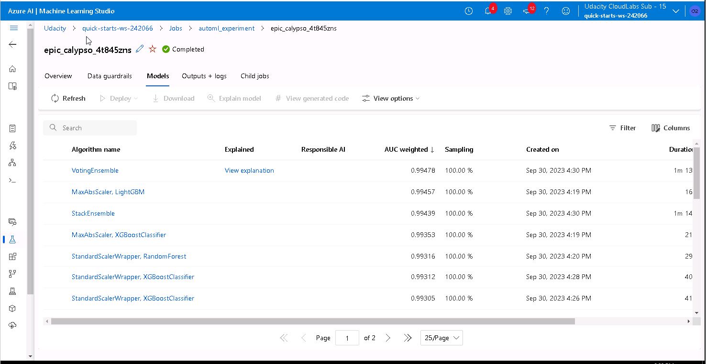

The hyperparameters of the `VotingEnsemble` can be obtained by printing `remote_run.get_output()`. This will show the individual hyperparameters of each of the 7 pipelines that compose the model. The models that compose the ensemble are 5 `XGBoostClassifier`, a `LightGBMClassifier` and a `SGDClassifierWrapper`. The weights of the `VotingEnsemble` are the following: `weights=[0.6, 0.06666666666666667, 0.06666666666666667, 0.06666666666666667, 0.06666666666666667, 0.06666666666666667, 0.06666666666666667]`. For more information, please check the corresponding section of `automl.ipynb`.

As it can be seen, all the models receive the same weights, except the first one, which receives the highest weight in the ensemble. This model consist on a pipeline which first applies `MaxAbsScaler()` to normalize the data and then uses a `LightGBM`.


The details of the execution can be found in the links shown in the following image.

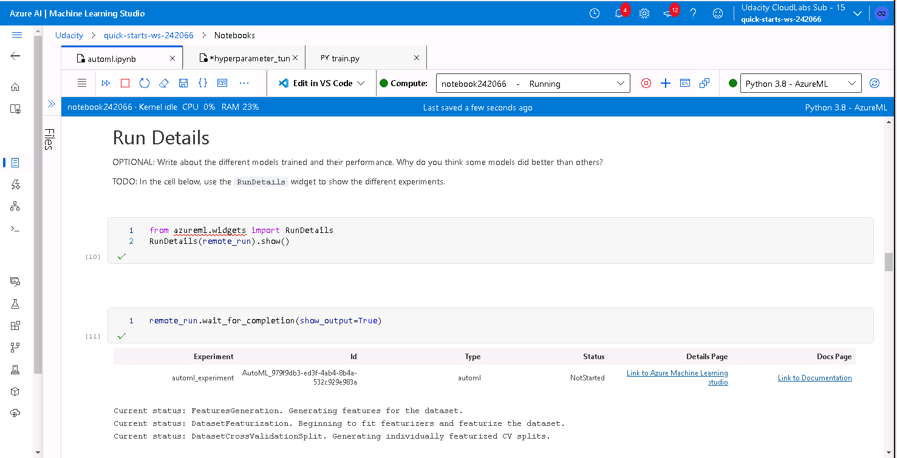


The rest of the details are included as raw text, since it cannot be included completely in an image. This can be found in `automl-copy.ipynb` notebook.

```ruby
********************************************************************************************
DATA GUARDRAILS: 

TYPE:         Cross validation
STATUS:       DONE
DESCRIPTION:  In order to accurately evaluate the model(s) trained by AutoML, we leverage a dataset that the model is not trained on. Hence, if the user doesn't provide an explicit validation dataset, a part of the training dataset is used to achieve this. For smaller datasets (fewer than 20,000 samples), cross-validation is leveraged, else a single hold-out set is split from the training data to serve as the validation dataset. Hence, for your input data we leverage cross-validation with 10 folds, if the number of training samples are fewer than 1000, and 3 folds in all other cases.
              Learn more about cross validation: https://aka.ms/AutomatedMLCrossValidation
DETAILS:      
+------------------------------+
|Number of folds               |
+==============================+
|3                             |
+------------------------------+

********************************************************************************************

TYPE:         Class balancing detection
STATUS:       PASSED
DESCRIPTION:  Your inputs were analyzed, and all classes are balanced in your training data.
              Learn more about imbalanced data: https://aka.ms/AutomatedMLImbalancedData

********************************************************************************************

TYPE:         Missing feature values imputation
STATUS:       PASSED
DESCRIPTION:  No feature missing values were detected in the training data.
              Learn more about missing value imputation: https://aka.ms/AutomatedMLFeaturization

********************************************************************************************

TYPE:         High cardinality feature detection
STATUS:       PASSED
DESCRIPTION:  Your inputs were analyzed, and no high cardinality features were detected.
              Learn more about high cardinality feature handling: https://aka.ms/AutomatedMLFeaturization

********************************************************************************************

********************************************************************************************
ITER: The iteration being evaluated.
PIPELINE: A summary description of the pipeline being evaluated.
DURATION: Time taken for the current iteration.
METRIC: The result of computing score on the fitted pipeline.
BEST: The best observed score thus far.
********************************************************************************************

 ITER   PIPELINE                                       DURATION            METRIC      BEST
    0   MaxAbsScaler LightGBM                          0:00:16             0.9946    0.9946
    1   MaxAbsScaler XGBoostClassifier                 0:00:21             0.9935    0.9946
    2   MaxAbsScaler ExtremeRandomTrees                0:00:12             0.9724    0.9946
    3   MaxAbsScaler RandomForest                      0:00:12             0.9755    0.9946
    4   StandardScalerWrapper LightGBM                 0:00:14             0.9743    0.9946
    5   SparseNormalizer XGBoostClassifier             0:00:13             0.9847    0.9946
    6   SparseNormalizer RandomForest                  0:00:22             0.9803    0.9946
    7   StandardScalerWrapper XGBoostClassifier        0:00:13             0.9915    0.9946
    8   SparseNormalizer XGBoostClassifier             0:00:16             0.9892    0.9946
   12   StandardScalerWrapper XGBoostClassifier        0:00:17             0.9862    0.9946
    9   MaxAbsScaler RandomForest                      0:00:13             0.9453    0.9946
   10   SparseNormalizer LightGBM                      0:00:12             0.9717    0.9946
   13   StandardScalerWrapper ExtremeRandomTrees       0:00:12             0.9680    0.9946
   16   MaxAbsScaler LogisticRegression                0:00:16             0.9705    0.9946
   17   StandardScalerWrapper ExtremeRandomTrees       0:00:43             0.9807    0.9946
   11   MaxAbsScaler ExtremeRandomTrees                0:00:30             0.9792    0.9946
   14   StandardScalerWrapper RandomForest             0:00:29             0.9932    0.9946
   18   StandardScalerWrapper XGBoostClassifier        0:00:14             0.9884    0.9946
   19   MaxAbsScaler ExtremeRandomTrees                0:00:14             0.9709    0.9946
   15   MaxAbsScaler LightGBM                          0:00:14             0.9846    0.9946
   20   MaxAbsScaler LogisticRegression                0:00:35             0.9701    0.9946
   21   StandardScalerWrapper XGBoostClassifier        0:00:36             0.9867    0.9946
   22   StandardScalerWrapper XGBoostClassifier        0:00:41             0.9930    0.9946
   23   MaxAbsScaler RandomForest                      0:00:35             0.9710    0.9946
   24   SparseNormalizer XGBoostClassifier             0:00:36             0.9848    0.9946
   26   MaxAbsScaler LightGBM                          0:00:36             0.9798    0.9946
   25   StandardScalerWrapper LightGBM                 0:00:38             0.9823    0.9946
   27   StandardScalerWrapper LightGBM                 0:00:34             0.9803    0.9946
   28   MaxAbsScaler LightGBM                          0:00:36             0.9871    0.9946
   29   MaxAbsScaler LightGBM                          0:00:34             0.9874    0.9946
   30   SparseNormalizer LightGBM                      0:00:38             0.9800    0.9946
   31   StandardScalerWrapper XGBoostClassifier        0:00:40             0.9931    0.9946
   32   StandardScalerWrapper LogisticRegression       0:00:37             0.9702    0.9946
   35   MaxAbsScaler LightGBM                          0:00:38             0.9839    0.9946
   37                                                  0:00:03                nan    0.9946
   33   MaxAbsScaler RandomForest                      0:01:00                nan    0.9946
   34   StandardScalerWrapper XGBoostClassifier        0:00:45                nan    0.9946
   36                                                  0:00:04                nan    0.9946
   38    VotingEnsemble                                0:01:13             0.9948    0.9948
   39    StackEnsemble                                 0:01:14             0.9944    0.9948

{'runId': 'AutoML_979f9db3-ed3f-4ab4-8b4a-532c929e983a',
 'target': 'cluster-udacity',
 'status': 'Completed',
 'startTimeUtc': '2023-09-30T16:10:09.076571Z',
 'endTimeUtc': '2023-09-30T16:32:07.173248Z',
 'services': {},
 'warnings': [{'source': 'JasmineService',
   'message': 'No scores improved over last 10 iterations, so experiment stopped early. This early stopping behavior can be disabled by setting enable_early_stopping = False in AutoMLConfig for notebook/python SDK runs.'}],
 'properties': {'num_iterations': '1000',
  'training_type': 'TrainFull',
  'acquisition_function': 'EI',
  'primary_metric': 'AUC_weighted',
  'train_split': '0',
  'acquisition_parameter': '0',
  'num_cross_validation': None,
  'target': 'cluster-udacity',
  'AMLSettingsJsonString': '{"path":null,"name":"automl_experiment","subscription_id":"d7f39349-a66b-446e-aba6-0053c2cf1c11","resource_group":"aml-quickstarts-242066","workspace_name":"quick-starts-ws-242066","region":"southcentralus","compute_target":"cluster-udacity","spark_service":null,"azure_service":"remote","many_models":false,"pipeline_fetch_max_batch_size":1,"enable_batch_run":true,"enable_parallel_run":false,"num_procs":null,"enable_run_restructure":false,"start_auxiliary_runs_before_parent_complete":false,"enable_code_generation":true,"iterations":1000,"primary_metric":"AUC_weighted","task_type":"classification","positive_label":null,"data_script":null,"test_size":0.0,"test_include_predictions_only":false,"validation_size":0.0,"n_cross_validations":null,"y_min":null,"y_max":null,"num_classes":null,"featurization":"auto","_ignore_package_version_incompatibilities":false,"is_timeseries":false,"max_cores_per_iteration":1,"max_concurrent_iterations":5,"iteration_timeout_minutes":null,"mem_in_mb":null,"enforce_time_on_windows":false,"experiment_timeout_minutes":20,"experiment_exit_score":null,"partition_column_names":null,"whitelist_models":null,"blacklist_algos":["TensorFlowLinearClassifier","TensorFlowDNN"],"supported_models":["LogisticRegression","MultinomialNaiveBayes","TensorFlowLinearClassifier","BernoulliNaiveBayes","RandomForest","LightGBM","SGD","DecisionTree","XGBoostClassifier","KNN","TabnetClassifier","ExtremeRandomTrees","GradientBoosting","LinearSVM","AveragedPerceptronClassifier","TensorFlowDNN","SVM"],"private_models":[],"auto_blacklist":true,"blacklist_samples_reached":false,"exclude_nan_labels":true,"verbosity":20,"_debug_log":"azureml_automl.log","show_warnings":false,"model_explainability":true,"service_url":null,"sdk_url":null,"sdk_packages":null,"enable_onnx_compatible_models":false,"enable_split_onnx_featurizer_estimator_models":false,"vm_type":"STANDARD_D2_V2","telemetry_verbosity":20,"send_telemetry":true,"enable_dnn":false,"scenario":"AutoML","environment_label":null,"save_mlflow":false,"enable_categorical_indicators":false,"force_text_dnn":false,"enable_feature_sweeping":true,"enable_early_stopping":true,"early_stopping_n_iters":10,"arguments":null,"dataset_id":"386f569b-55e5-476a-b65d-2f5a5a0b3a51","hyperdrive_config":null,"validation_dataset_id":null,"run_source":null,"metrics":null,"enable_metric_confidence":false,"enable_ensembling":true,"enable_stack_ensembling":true,"ensemble_iterations":15,"enable_tf":false,"enable_subsampling":null,"subsample_seed":null,"enable_nimbusml":false,"enable_streaming":false,"force_streaming":false,"track_child_runs":true,"n_best_runs":1,"allowed_private_models":[],"label_column_name":"left","weight_column_name":null,"cv_split_column_names":null,"enable_local_managed":false,"_local_managed_run_id":null,"cost_mode":1,"lag_length":0,"metric_operation":"maximize","preprocess":true}',
  'DataPrepJsonString': '{\\"training_data\\": {\\"datasetId\\": \\"386f569b-55e5-476a-b65d-2f5a5a0b3a51\\"}, \\"datasets\\": 0}',
  'EnableSubsampling': None,
  'runTemplate': 'AutoML',
  'azureml.runsource': 'automl',
  'display_task_type': 'classification',
  'dependencies_versions': '{"azureml-dataprep-native": "38.0.0", "azureml-dataprep": "4.10.8", "azureml-dataprep-rslex": "2.17.12", "azureml-train-automl-runtime": "1.51.0.post2", "azureml-train-automl-client": "1.51.0.post1", "azureml-training-tabular": "1.51.0.post1", "azureml-automl-runtime": "1.51.0.post1", "azureml-automl-core": "1.51.0.post1", "azureml-mlflow": "1.51.0", "azureml-datadrift": "1.51.0", "azureml-pipeline": "1.51.0", "azureml-contrib-dataset": "1.51.0", "azureml-contrib-notebook": "1.51.0", "azureml-accel-models": "1.51.0", "azureml-automl-dnn-nlp": "1.51.0", "azureml-pipeline-core": "1.51.0", "azureml-responsibleai": "1.51.0", "azureml-contrib-automl-pipeline-steps": "1.51.0", "azureml-pipeline-steps": "1.51.0", "azureml-core": "1.51.0", "azureml-contrib-reinforcementlearning": "1.51.0", "azureml-contrib-server": "1.51.0", "azureml-opendatasets": "1.51.0", "azureml-contrib-services": "1.51.0", "azureml-telemetry": "1.51.0", "azureml-train-restclients-hyperdrive": "1.51.0", "azureml-interpret": "1.51.0", "azureml-train-core": "1.51.0", "azureml-tensorboard": "1.51.0", "azureml-train": "1.51.0", "azureml-contrib-pipeline-steps": "1.51.0", "azureml-explain-model": "1.51.0", "azureml-cli-common": "1.51.0", "azureml-widgets": "1.51.0", "azureml-train-automl": "1.51.0", "azureml-defaults": "1.51.0", "azureml-contrib-fairness": "1.51.0", "azureml-sdk": "1.51.0", "azureml-dataset-runtime": "1.51.0", "azureml-inference-server-http": "0.8.4"}',
  '_aml_system_scenario_identification': 'Remote.Parent',
  'ClientType': 'SDK',
  'PlatformVersion': 'DPV1',
  'environment_cpu_name': 'AzureML-AutoML',
  'environment_cpu_label': 'prod',
  'environment_gpu_name': 'AzureML-AutoML-GPU',
  'environment_gpu_label': 'prod',
  'root_attribution': 'automl',
  'attribution': 'AutoML',
  'Orchestrator': 'AutoML',
  'CancelUri': 'https://southcentralus.api.azureml.ms/jasmine/v1.0/subscriptions/d7f39349-a66b-446e-aba6-0053c2cf1c11/resourceGroups/aml-quickstarts-242066/providers/Microsoft.MachineLearningServices/workspaces/quick-starts-ws-242066/experimentids/97a7d825-4271-4b06-a0b0-13a316936862/cancel/AutoML_979f9db3-ed3f-4ab4-8b4a-532c929e983a',
  'ClientSdkVersion': None,
  'snapshotId': '00000000-0000-0000-0000-000000000000',
  'SetupRunId': 'AutoML_979f9db3-ed3f-4ab4-8b4a-532c929e983a_setup',
  'SetupRunContainerId': 'dcid.AutoML_979f9db3-ed3f-4ab4-8b4a-532c929e983a_setup',
  'FeaturizationRunJsonPath': 'featurizer_container.json',
  'FeaturizationRunId': 'AutoML_979f9db3-ed3f-4ab4-8b4a-532c929e983a_featurize',
  'ProblemInfoJsonString': '{"dataset_num_categorical": 0, "is_sparse": true, "subsampling": false, "has_extra_col": true, "dataset_classes": 2, "dataset_features": 40, "dataset_samples": 14999, "single_frequency_class_detected": false}',
  'ModelExplainRunId': 'AutoML_979f9db3-ed3f-4ab4-8b4a-532c929e983a_ModelExplain'},
 'inputDatasets': [{'dataset': {'id': '386f569b-55e5-476a-b65d-2f5a5a0b3a51'}, 'consumptionDetails': {'type': 'RunInput', 'inputName': 'training_data', 'mechanism': 'Direct'}}],
 'outputDatasets': [],
 'logFiles': {},
 'submittedBy': 'ODL_User 242066'}
```

Once the training process finishes, we can obtain the information about the best model, proceeding as it can be seen in the following image:

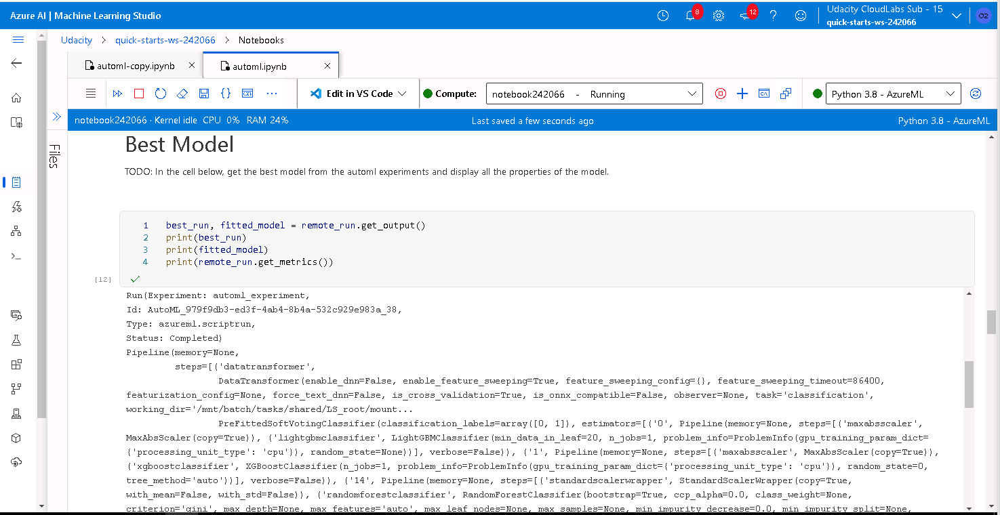

An example of the information shown with the previous links can be seen in the following image, which sumarizes the metrics of the best trained model.

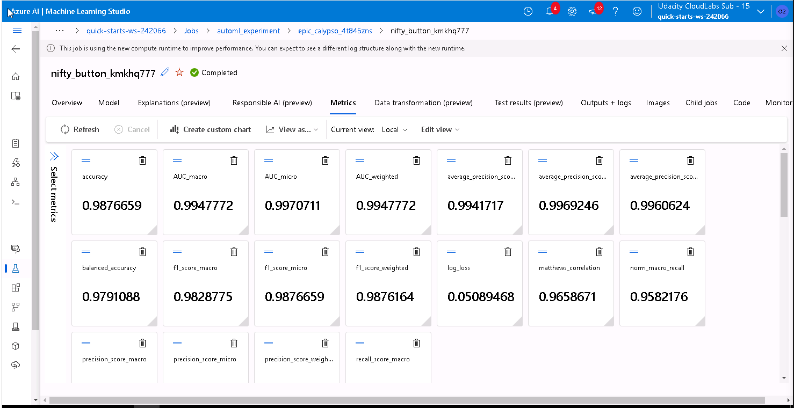

Once we have decided which is the best model, we proceed to register it in the model register that AzureML provide to us.

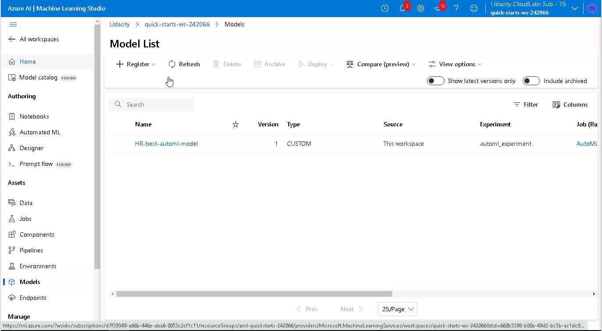


## Hyperparameter Tuning

An initial code `train.py` was provided, which is responsible for:
  * Creating a `TabularDatasetFactory` from an online CSV file.
  * Data cleansing and enconde categorical data into numeric format using one-hot encoding or ordinal encoding when applicable.
  * Splitting the resulting data into train and test subsets. This is a common practice to ensure that the trained model is evaluated with a different subset than the one used to train it.
  * Using the function `LogisticRegressionClassifier` from `scikit-learn`, which implements the Logistic Regressión algorithm. This model tries to find the underlying relationship between the target variable `y` and the rest of the features in the dataset.
  * Saving the model as a pickle file, recording the value of its hyperparameter.

The input arguments of `train.py` script are the two hyperparameters that will be used to train the `LogisticRegressionClassifier`.
  * The first is the hyperparameter `C`, which represents the inverse of regularization strength. Smaller values cause stronger regularization.
  * The second is the hyperparameter `max_iter`, which represents the maximum number of iterations to converge.

Finally, the implementation of the hyperdrive job is located in a Jupyter notebook called `udacity-project.ipynb`. This job will execute the `train.py` script several times with different hyperparameter configurations. These configurations are specified by a parameter sample (`RandomParameterSampling`), that will randomly choose from the range of values specified by the user. Moreover, a policy is defined (`BanditPolicy`) for early stopping in case some specific conditions are met.


The benefits of the parameter sampler is that it explores randomly a hyperparameter space, saving a lot of time compared to an exhaustive search.

* The hyperparameter `C` take a uniform distribution bounded to two values.
* The `max_iter` parameter can be chosen from a given set that ranges from 10 to 100, with a step of 10.


The benefits of choosing `BanditPolicy`, is that it defines an early stopping policy based on slack criteria and a frequency and delay interval for evaluation.

The `slack_factor` is the ratio used to calculate the allowed distance from the best performing run. We chose a value of 10%, so if in each time the policy is evaluated (as defined by `evaluation_interval`), the metric falls below the slack respect the best performing model, the job is terminated. This allows us to finish before reaching the maximum number of iterations (`max_total_runs`)  if the model is not improving with each iteration, therefore saving computing time.

In the following piece of code, I include the HyperDrive configuration that I have chosen for this experiment.

```ruby
from azureml.train.hyperdrive.policy import BanditPolicy
from azureml.train.hyperdrive.sampling import RandomParameterSampling
import numpy as np

# Early termination policy
early_termination_policy = BanditPolicy(slack_factor = 0.1, 
                                        evaluation_interval = 2,
                                        delay_evaluation = 10)


#Parameter sampling definition
param_sampling = RandomParameterSampling( {
    "--C" : uniform(0.0,10.0),
    "--max_iter" : choice(10,20,30,40,50,60,70,80,90,100)
    }
)


estimator = ScriptRunConfig(source_directory='.',
                            command=['python', 'train.py'],
                            compute_target=cluster_name,
                            environment=sklearn_env)

hyperdrive_run_config = HyperDriveConfig(run_config=estimator, 
                             hyperparameter_sampling=param_sampling,
                             policy=early_termination_policy,
                             primary_metric_name='Accuracy',
                             primary_metric_goal= PrimaryMetricGoal.MAXIMIZE,
                             max_total_runs = 4,
                             max_concurrent_runs = 2)
```

### Results

The best hyperparameter configuration that HyperDrive has found is the following:

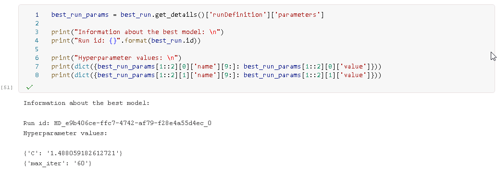

* `C`: 1.488059
* `max_iter`: 60

The results obtained with HyperDrive class can are summarized in the following image. 

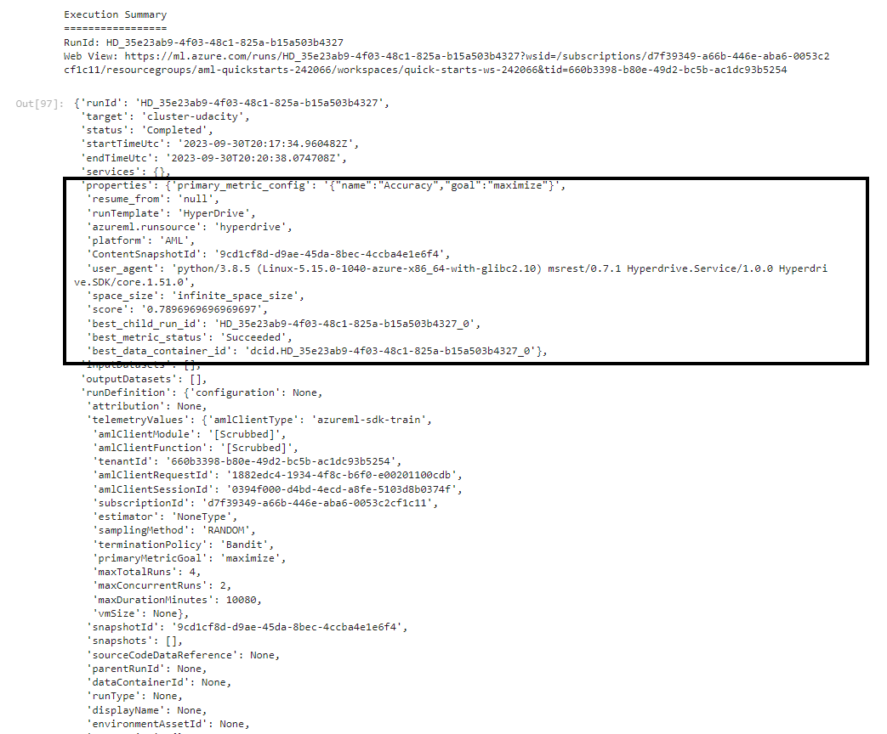

As it can be seen, this model performs much worse than the model obtained with AutoML. Even if in this case, the model was optimized based on accuracy metric, the accuracy of the `VotingEnsemble` is much higher:
  * `LogisticRegression`: 78,97% accuracy
  * `VotingEnsemble`: 98,77% accuracy


In the following image, it could be seem that both the best model generated by the AutoML process and the one generated sith HyperDrive have been registered in the model registry tool of AzureML.

[HyperDrive_model](./screenshots/HyperDrive_model_registration.PNG)


## Model Deployment

Based on the previous results, we decided to deploy the model generated with AutoML process since it has obtained higher values in all the relevant metrics. The deployment process was done using Azure Container Instance (ACI).

The following piece of code shows the ACI web service configuration: 

```ruby
# Deploy model
from azureml.train.automl.run import AutoMLRun
run_id= 'AutoML_979f9db3-ed3f-4ab4-8b4a-532c929e983a_38' #best run (from the previous cell output)
best_run=AutoMLRun(experiment, run_id)

# Retrive model by name
model = Model(ws, 'HR-best-automl-model')

#Get the environment from the best run
env = best_run.get_environment()

script_file = 'score.py'
best_run.download_file('outputs/scoring_file_v_1_0_0.py', script_file)

from azureml.core.model import InferenceConfig
from azureml.core.webservice import AciWebservice
from azureml.core.webservice import Webservice
from azureml.core.model import Model
from azureml.core.environment import Environment

inference_config = InferenceConfig(entry_script=script_file, environment=env)

deployment_config = AciWebservice.deploy_configuration(cpu_cores = 1, 
                                                       memory_gb = 1)

deploy_service_name= 'automl-model-deployment'
service = Model.deploy(ws,deploy_service_name,  [model], inference_config, deployment_config)

service.wait_for_deployment(show_output = True)

scoring_uri = service.scoring_uri

print("State: ",service.state)
print("\nScoring URI: ", scoring_uri)

```

The following image shows the ACI web service configuration, with the healthy status and the scoring URI:

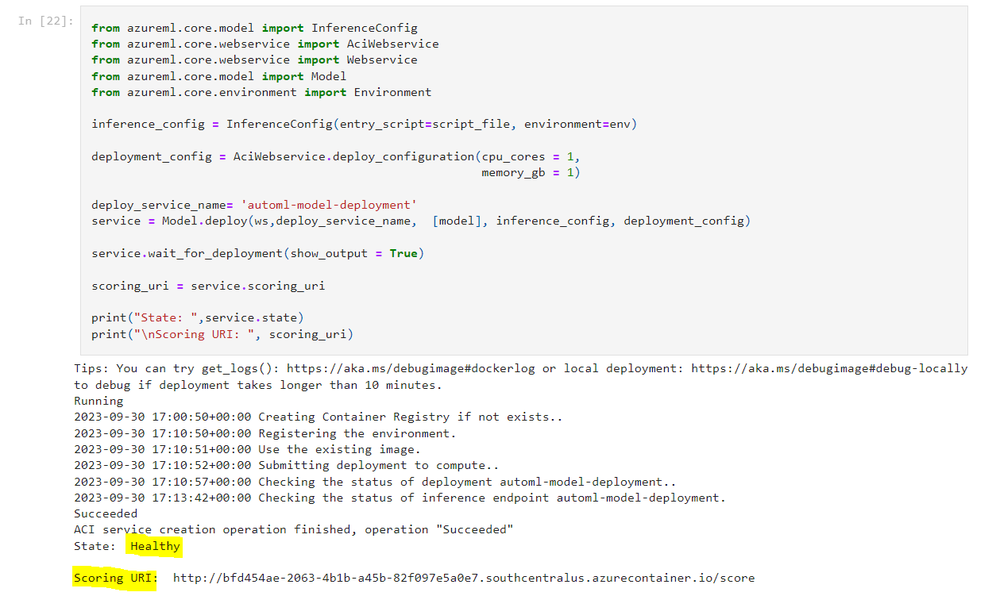

Once the model is deployed, we can see the endpoint in the corresponding section of AzureML:

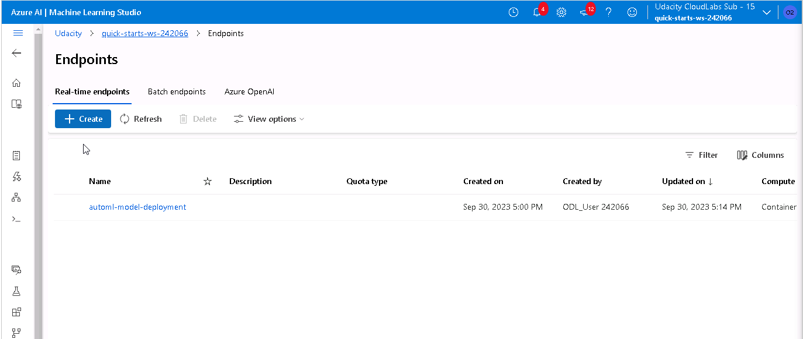

If we click in this link we can get some information about the status of the endpoint:

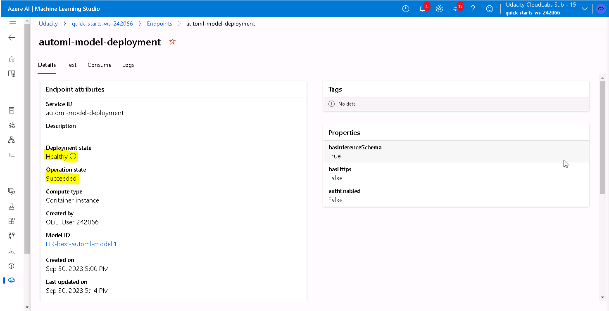

The way to query the model endpoint is shown in the following image. What we have done to test it, is to take 2 samples of the original dataframe, drop the attribute 'left' since it is the one that we one to predict, transform it to JSON format, and then use the JSON as the input data for the model endpoint. The results are highlighted in yellow.

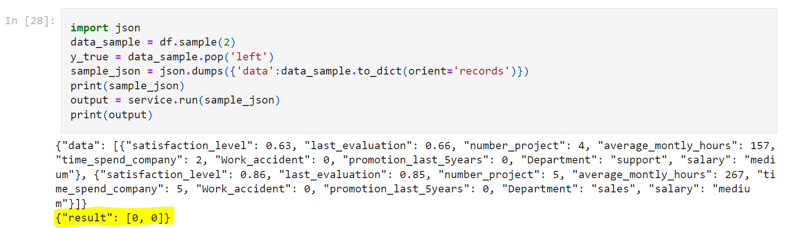

Moreover, we activated the Application Insights using the following piece of code so as to monitor the logs of the model endpoint.

```ruby
#Enable application insights
service.update(enable_app_insights=True)
```

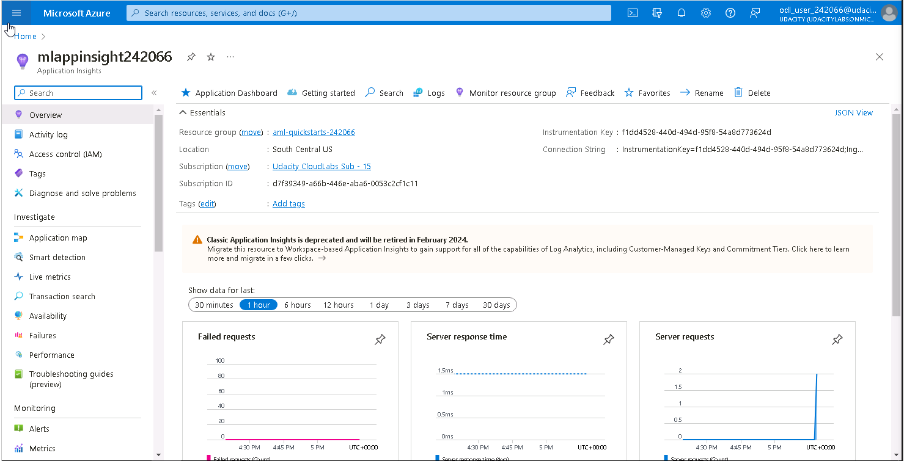

We can access to the Application Insights using the following url:

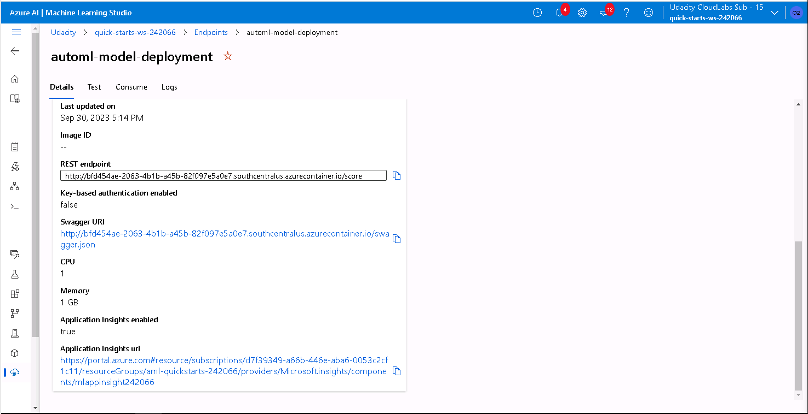


Once all the experiments are finished, we proceed to eliminate the services created to avoid incurring unnecessary costs.

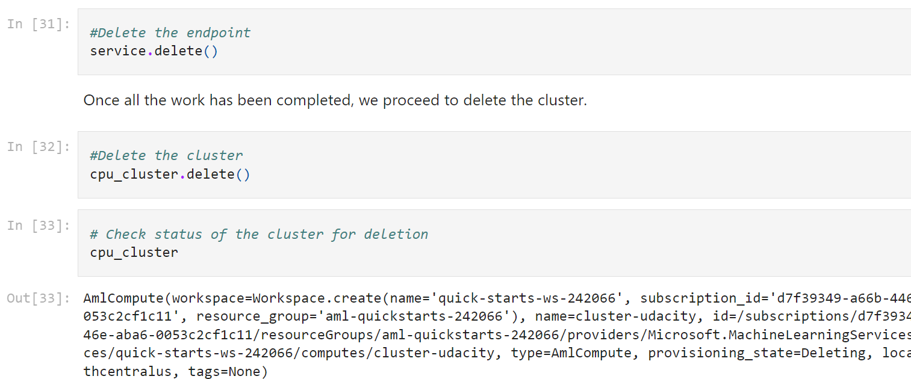


## Screen Recording
Link of screencast video: [Youtube_video](https://youtu.be/NHvwtG6lIeE?feature=shared&t=33). It includes:
- A working model
- Demo of the deployed  model


Link of the second screencast video_ [Youtube_endpoint_video](https://youtu.be/qoUK6FEMf8A?feature=shared&t=40). It includes:
- Example of model endpoint consumption based on REST URL and key.


## Future Work

* Export the model to support [ONNX](https://learn.microsoft.com/en-us/azure/machine-learning/concept-onnx?view=azureml-api-2)
* Retrain the model periodically with more recent data, since employees preferences change over time and we have to monitor [data drift](https://learn.microsoft.com/en-us/azure/machine-learning/how-to-monitor-datasets?view=azureml-api-1&tabs=python).
