*NOTE:* This file is a template that you can use to create the README for your project. The *TODO* comments below will highlight the information you should be sure to include.

# Employee Churn Rate Problem

*TODO:* Write a short introduction to your project.

A company concerned about the growth in the attrition rate of its employees has asked us to carry out a predictive analysis to be able to anticipate possible future abandonments. So that at the end of the project, you know which group of employees your talent retention efforts focused on.

To carry out this project, I used two tools that Azure ML provide us to train Machine Learning models: Azure Hyperdrive and Azure AutoML. Then, I deployed the best model generated by both methods and consumed the model endpoint to provide some predictions.

The steps followed in the project are summarized in the following diagram:


## Project Set Up and Installation
*OPTIONAL:* If your project has any special installation steps, this is where you should put it. To turn this project into a professional portfolio project, you are encouraged to explain how to set up this project in AzureML.


## Dataset

### Overview
*TODO*: Explain about the data you are using and where you got it from.

For this project the company have given us the file `HR Dataset` (https://raw.githubusercontent.com/aiplanethub/Datasets/master/HR_comma_sep.csv), which can download be downloaded from the following link: https://raw.githubusercontent.com/aiplanethub/Datasets/master/HR_comma_sep.csv. The file contains the following variables:

  * satisfaccion_nivel : It is the level of employee satisfaction, which takes values between 0-1.
  * last_ Evaluation : Employee's preformance evaluation. Values between 0-1.
  * number_projects : How many projects are asigned to thar employee?
  * average_monthly_hours : How many average hours does an employee work in a month?
  * time_spent_company : Employee experience. Number of years an employee has been in the company.
  * work_accident : Whether an employee has had a work accident or not.
  * Promotion_last_5years : Whether an employee has had a promotion in the last 5 years or not.
  * sales : Department/division to which the employee belongs.
  * salario : Salary level of the employee (low, medium or high).
  * left : Whether the employee has left the company or not (0: No, 1: Yes).


The variable to predict (target) is `left` and the rest can be used as explanatory variables for the study. A sample of the data is as follows:


### Task
*TODO*: Explain the task you are going to be solving with this dataset and the features you will be using for it.

The aim of this project is to develop a machine learning model that can predict whether an employee is going to leave the company or not. Therefore, the target variable is the variable `left`. Since it can take just to possible values, we have to perform a classification task. 

A sample of the data is as follows:

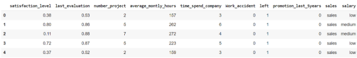

### Access
*TODO*: Explain how you are accessing the data in your workspace.

The way I uploaded the dataset to the AzureML environment, was using the following piece of code that you can find in the Jupyter Notebooks `automl.ipynb` and `hyperparameter_tuning.ipynb`.


In this code we defined a variable that includes the workspace definition. Then we check whether the dataset is already uploaded to the AzureML platform, and if that is not the case we upload it.

Once the dataset is uploaded into AzureML, you can find it in the `Data` section of the platform:

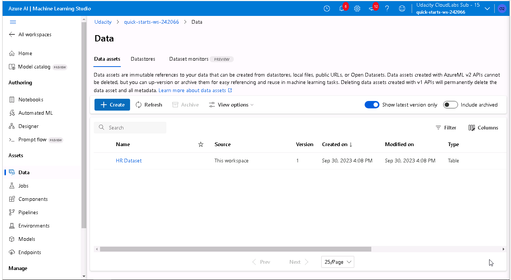

We can get a sample of the dataset using the `Explore` window.

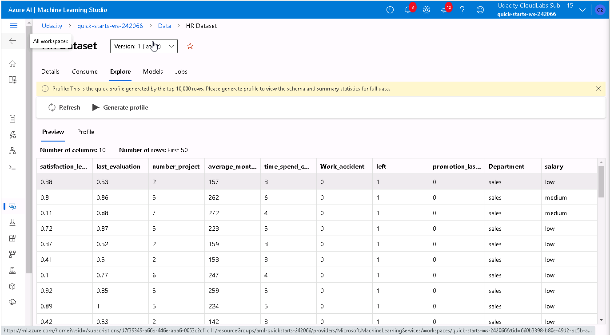

## Automated ML
*TODO*: Give an overview of the `automl` settings and configuration you used for this experiment

In the following image, I include the AutoML configuration that I have chosen for this experiment.

```ruby
automl_settings = {
    "experiment_timeout_minutes": 20,
    "max_concurrent_iterations": 5,
    "primary_metric" : 'AUC_weighted'
}

# TODO: Put your automl config here
automl_config = AutoMLConfig(compute_target=cpu_cluster,
                             task = "classification",
                             training_data=dataset,
                             label_column_name="left",   
                             path = project_folder,
                             enable_early_stopping= True,
                             featurization= 'auto',
                             debug_log = "automl_errors.log",
                             **automl_settings
                            )

```


### Results
*TODO*: What are the results you got with your automated ML model? What were the parameters of the model? How could you have improved it?

*TODO* Remeber to provide screenshots of the `RunDetails` widget as well as a screenshot of the best model trained with it's parameters.


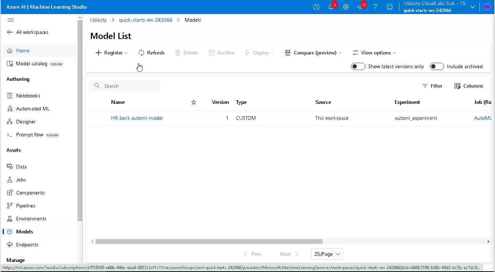

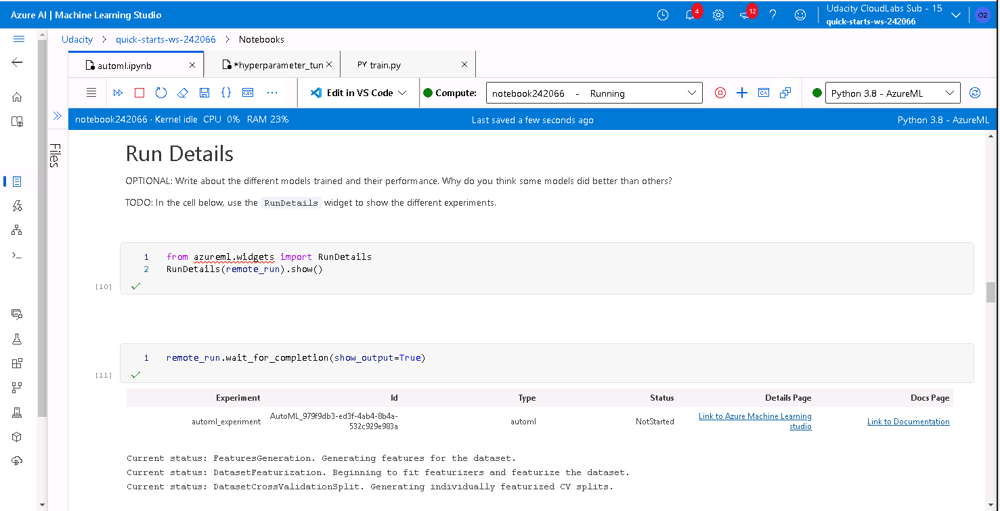

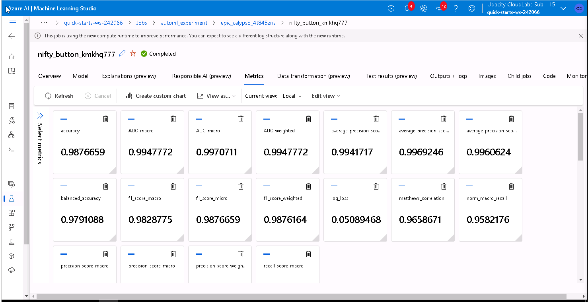

## Hyperparameter Tuning
*TODO*: What kind of model did you choose for this experiment and why? Give an overview of the types of parameters and their ranges used for the hyperparameter search


### Results
*TODO*: What are the results you got with your model? What were the parameters of the model? How could you have improved it?

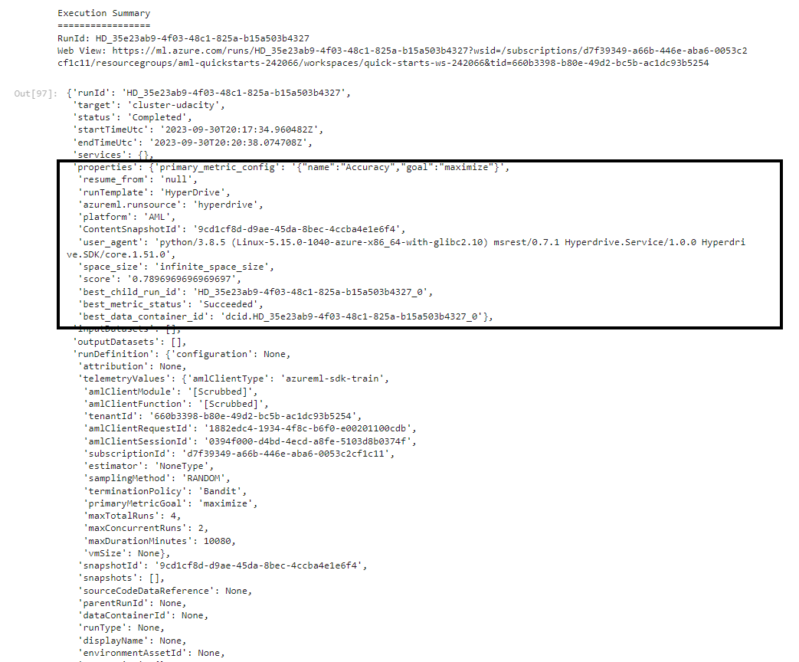

*TODO* Remeber to provide screenshots of the `RunDetails` widget as well as a screenshot of the best model trained with it's parameters.
[HyperDrive_model](./screenshots/HyperDrive_model_registration.PNG)

## Model Deployment
*TODO*: Give an overview of the deployed model and instructions on how to query the endpoint with a sample input.

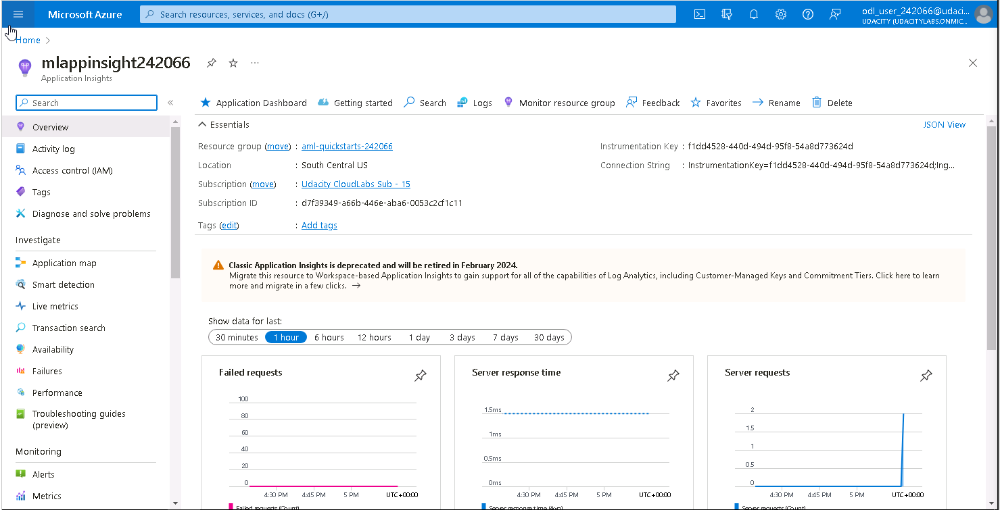

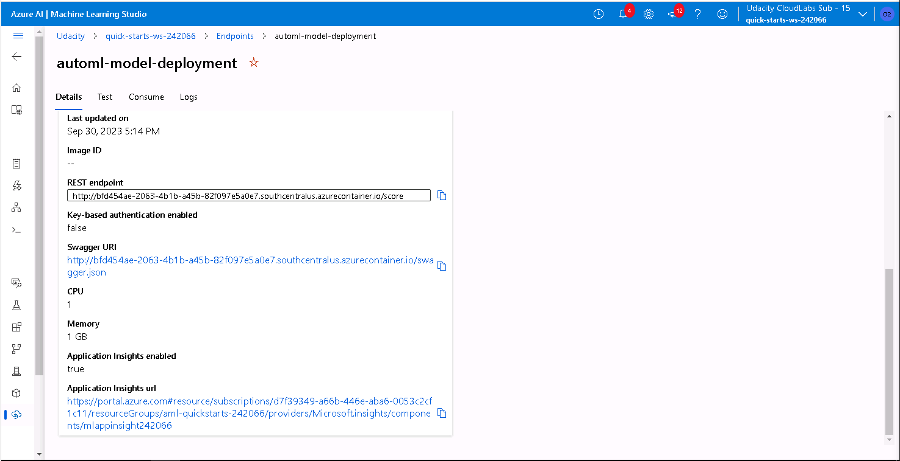

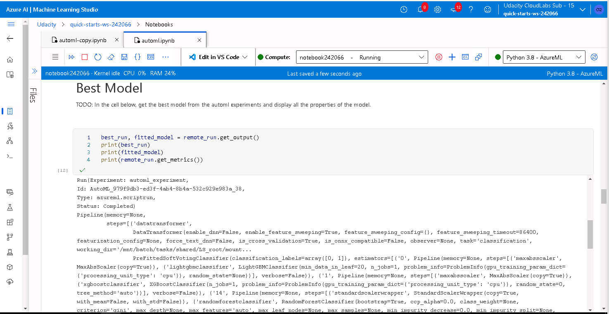

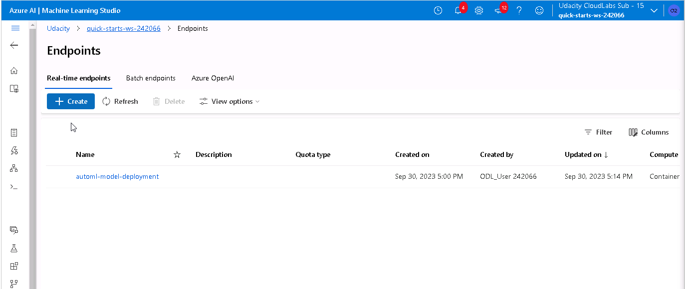

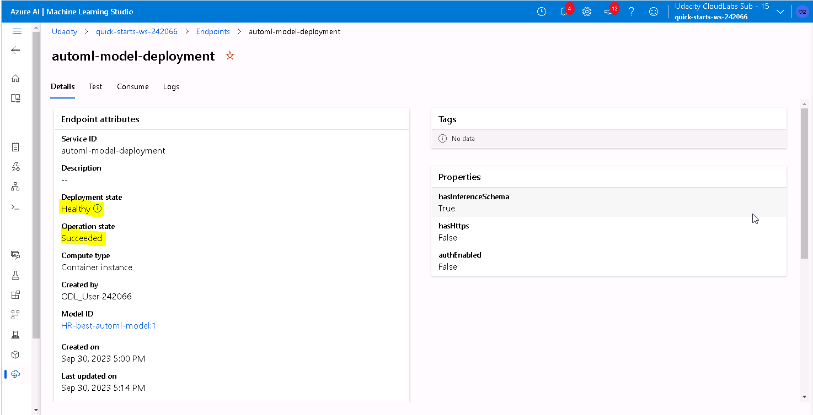


## Screen Recording
*TODO* Provide a link to a screen recording of the project in action. Remember that the screencast should demonstrate:
- A working model
- Demo of the deployed  model
- Demo of a sample request sent to the endpoint and its response

[Youtube_video](https://youtu.be/NHvwtG6lIeE?feature=shared&t=33)

## Standout Suggestions
*TODO (Optional):* This is where you can provide information about any standout suggestions that you have attempted.
